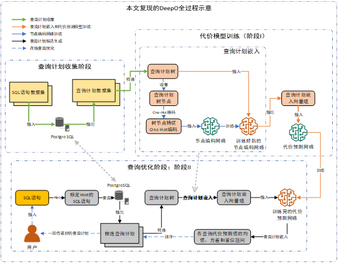
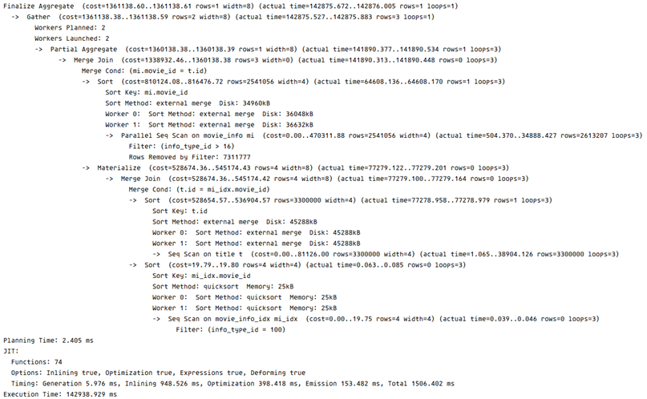
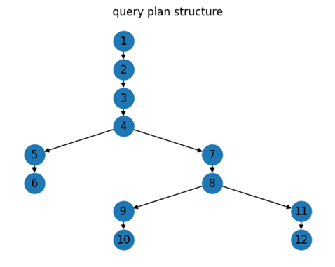
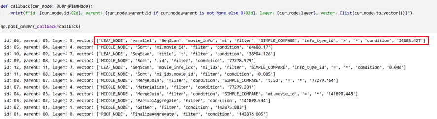
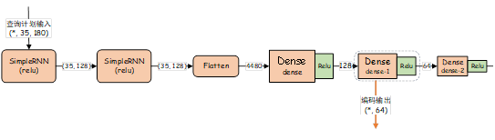
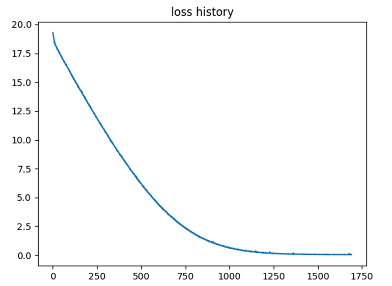
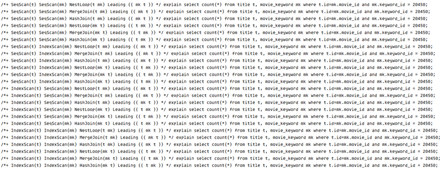
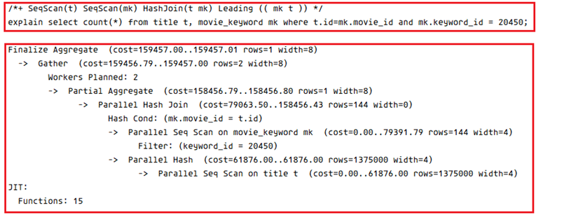
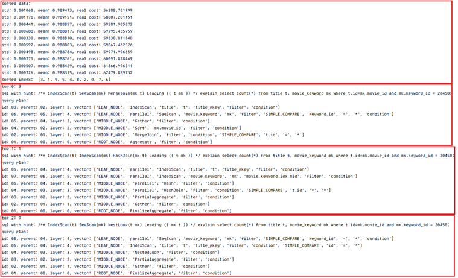

## Forked From [RUC-AIDB/DeepO](https://github.com/RUC-AIDB/DeepO)

## 介绍



> <span style="font-size:30px;margin-right:10px;color:rgba(0,0,0,0.0);"><i>0</i></span>
> 根据 `DeepO` 的实现逻辑，本章也将 `DeepO` 分为离线的代价模型训练阶段和在线的查询优化阶段，后文称为阶段I和阶段II
> <span style="font-size:30px;margin-right:10px;color:rgba(0,0,0,0.1);"><i>1</i></span>
> 阶段 I 先实现查询计划的二叉树重构和特征提取，在此基础上完成查询计划的嵌入，生成数值向量表示的训练数据并在贝叶斯`LSTM`
> 网络中训练代价预测网络。阶段I的输出包括查询计划嵌入模型（主要指节点编码网络）和代价预测网络。<br>
> <span style="font-size:30px;margin-right:10px;color:rgba(0,0,0,0.1);"><i>2</i></span>
> 阶段 II 首先会对用户输入的`SQL`做解析，获取查询涉及到的所有表进而生成用于可修改查询策略的`Hint`标定到`SQL`语句前，
> `Hint` 可调整物理查询计划表扫描算法、表连接算法和表连接顺序。接着利用
> `PostgreSQL` 的 `EXPLAIN` 指令获取所有被标定 `Hint` 的 `SQL` 的物理查询计划，并应用阶段I生成的查询计划嵌入模型生成网络查询计划嵌入向量，
> 输入到代价预测模型中获取本查询的代价估计值。<br>
> <span style="font-size:30px;margin-right:10px;color:rgba(0,0,0,0);"><i>3</i></span>
> 代价预测网络使用了贝叶斯 LSTM 网络，这意味着网络中的部分参数为随机变量，因此对于相同的查询计划，网络的输出可能会有差异。
> 程序会获取同一查询计划的多次代价估计值并计算均值和方差，按均值和方差对获取到的全部查询计划排序，
> 选出排名靠前的`Top k`个查询计划及其对应的`Hint`作为阶段II的输出。

### 主要修改

> 本章实现的 DeepO 遵循了作者在文中的总体实现思路，但对查询计划的嵌入过程做了部分修改
> - 修改作者提供的对查询计划树的表示逻辑，将 `PostgreSQL` 提供的物理查询计划表示为节点操作的二叉树形式，且该操作在阶段 I
    的较早阶段完成；
> - 修改作者对叶子节点的特征提取逻辑，加入了对由 `AND` 和 `OR` 连接的复合条件表达式的支持以及对 `ANY` 和 `ALL`
    运算符的支持。另外对常数值的提取和规范化也被剔除。一方面，这样做可以避免 `DeepO` 对基数估计的依赖；另一方面，由于` DeepO`
    被设计为可不断学习且需要重复训练的查询优化器，在训练数据较少的情况下，模型可能会对特定的的常数值产生依赖而影响后续的学习过程；
> - 修改作者对叶子节点和非叶节点分别处理、分别编码的过程，将它们统一为相同的查询计划节点描述，并在查询计划嵌入时考虑节点所处的位置。

## 代码目录


|            目录或文件	            |      简介       |                          	目录或文件                          |     	简介     |
|:----------------------------:|:-------------:|:--------------------------------------------------------:|:-----------:|
|  [data/model](data/model)	   |   保存生成的模型	    |             [src/config.py](src/config.py)	              |   存储配置信息    |
|    [data/npy](data/npy)	     |    保存训练数据	    |         [src/query_plan.py](src/query_plan.py)	          |   查询计划格式化   |
|  [data/output](data/output)  |  	保存查询计划输出结果  |          [src/embedding.py](src/embedding.py)	           |   查询计划嵌入    |
|    [data/pic](data/pic)	     |  保存项目所需要的图像   |       [src/cost_learner.py](src/cost_learner.py)	        |  代价估计模型训练   |
|    [data/pkl](data/pkl)	     | 保存pickle序列化对象 | [src/extract_table_names.py](src/extract_table_names.py) | 	获取SQL语句中的表 |
|   [data/*plan](data/plan)    |  	保存训练用查询计划   |      [src/hint_generate.py](src/hint_generate.py)	       |  获取优化查询计划   |
| [src/basic.py](src/basic.py) | 	数据库连接类和日志类	  |                   [main.py](main.py)	                    |  测试已实现的功能   |

## 运行

### 数据库和训练环境准备

1. 您可以在`windows`, `mac`或`linux`上运行该项目
2. 安装`PostgreSQL`数据库，复现时使用的版本为14
3. 在`PostgreSQL`中安装好[`pg_hint_plan`](https://pghintplan.osdn.jp/pg_hint_plan.html)插件
4. 下载项目[`JOB`](https://github.com/concretevitamin/join-order-benchmark),
   按照该项目[`README`](https://github.com/concretevitamin/join-order-benchmark/blob/master/README.md)的步骤载入`IMDB`
   数据库
5. `JOB`中提供了一部分训练数据, 载入完成后, 如果索引有问题，请执行`fkindexes.sql`修复
6. 训练数据的另一部分来自项目[`learnedcardinalities/workloads`](https://github.com/andreaskipf/learnedcardinalities/tree/master/workloads),
您可以下载该项目或者仅下载负载

### `Python3`安装和环境配置

1. 推荐`python3.9`
2. 请确保以下第三方库已被安装
    - `tensorflow`: `2.6.0`, 用于**节点嵌入网络**的训练
    - `pytorch`: `1.12.1`, 用于**代价预测网络**的训练
    - `scikit-learn`: `1.3.1`, 用于做**单词的`One-Hot`编码以及测试训练集的划分**
    - `blitz`: `0.2.7`, 用于将`nn.Module`上的权重采样(**⚠暂时做这样解释, 这部分了解的不是很全面**)
    - `sqlparse`: `0.4.3`, 用于解析用户输入的`SQL`语句
    - `psycopg2`: `2.9.1`, 用于建立与`PostgreSQL`数据库的连接 (**⚠珍爱生命, 远离`Apple M1`**)
    - `rich`, 用于打印好看的表格, 打印日志, 打印字典(**!啊, 爱死这个库了**)
    - `tqdm`, 用于做进度条, 用起来方便, 没有`rich`做的好看
3. 因为该交作业了, 没来得及做命令行参数, 因此下面脚本的执行有点复杂, 如果您有任何问题,
   都可以通过<a href="mailto://hanbing.mcga@qq.com">📫个人邮箱</a>与我联系

### 获取训练数据(查询计划)

1. 打开[`src/config.py`](src/config.py), 修改变量`DB_LAB_VM_CONFIG`中保存的连接信息为自己的数据库连接信息
2. 打开[`main.py`](main.py), 查看`get_train_data`方法, 将其中`sql_path`变量改成你自己保存SQL语句的路径, `output_dir`
   修改为保存输出查询计划的路径,
    - 如果您使用如`Pycharm`这样的大型`IDE`, 请一定将以上路径`Excluded`
    - 注意控制并行执行的线程数, 视自己的服务器性能而定, 保持`DBMS`的`CPU占用率`在`60%`以下最佳
3. 注释掉`main`中多余的部分, 只执行`get_train_data`函数

### 训练代价网络

1. 打开[`main.py`](main.py), 查看函数`embedding_and_train_cost_net()`, 该函数封装了代价网络训练的全过程，包括节点编码网络的训练
2. 如果对现在的此参数不满意，您可以在文件[`src/embedding`](src/embedding.py)
   和文件[`src/cost_learner.py`](src/cost_learner.py)中修改

### 获取最佳置信区间和在线查询优化

1. 打开[`main.py`](main.py), 函数`get_width_of_confidence_intervals()`, 该函数可用于获取置信区间,
   即第一个概率超过0.9的ci_multiplier
2. 函数`query_optimization_demo`用于执行以下SQL语句的查询优化

```sql
select count(*)
from title t,
     movie_keyword mk
where t.id = mk.movie_id
  and mk.keyword_id = 20450;
```

## 部分截图

### 查询计划嵌入

#### sql语句

```sql
/*+ SeqScan(t) SeqScan(mi) SeqScan(mi_idx) MergeJoin(t mi_idx) MergeJoin(mi t mi_idx) Leading (( mi ( t mi_idx ) )) */
EXPLAIN ANALYSE
SELECT COUNT(*)
FROM title t,
     movie_info mi,
     movie_info_idx mi_idx
WHERE t.ID = mi.movie_id
  AND T.ID = mi_idx.movie_id
  AND mi.info_type_id > 16
  AND mi_idx.info_type_id = 100;
```

#### `PostgreSQL` 给出的查询计划



#### 查询计划的二叉树表示



#### 查询计划的后序遍历结果



#### 节点编码网络示意图



#### 节点编码网络的训练过程


### 代价预测网络

#### 代价预测网络示意图


#### 代价预测网络训练过程中损失函数输出随迭代次数的变化关系



#### 确定置信区间的实验数据

<style>
.center 
{
  width: auto;
  display: table;
  margin-left: auto;
  margin-right: auto;
}
</style>

<p align="center"><font face="微软雅黑" size=2.>表格: 确定置信区间的实验数据</font></p>

<div class="center" style="font-family: 'Consolas', 'Monaco', 'Bitstream Vera Sans Mono', monospace">

| ci_multiplier |       	落在置信区间的概率        | 	ci_multiplier	 | 落在置信区间的概率 |
|:-------------:|:-----------------------:|:---------------:|:---------:|
|       6       | 	            0.150442 	 |       18	       | 0.823009  |
|       7       | 	            0.194690 	 |       19	       | 0.752212  |
|       8       | 	            0.185841 	 |       20	       | 0.840708  |
|       9       | 	            0.256637 	 |       21	       | 0.893805  |
|      10       |   	        0.265487 	   |       22	       | 0.840708  |
|      11       |   	        0.283186 	   |       23	       | 0.893805  |
|      12       |   	        0.380531 	   |       24	       | 0.946903  |
|      13       |   	        0.442478 	   |       25	       | 0.920354  |
|      14       |   	        0.433628 	   |       26	       | 0.929204  |
|      15       |   	        0.601770 	   |       27	       | 0.955752  |
|      16       |   	        0.672566 	   |       28	       | 0.946903  |
|      17       |   	        0.628319 	   |       29	       | 0.973451  |

</div>

### 在线查询优化阶段

#### 获取SQL中涉及的表

```python

from src.extract_table_names import extract_tables

sql = """
select count(*) from title t, movie_keyword mk where t.id=mk.movie_id and mk.keyword_id = 20450;
"""

extract_tables(sql)
# # ['t', 'mk']
```

#### 获取标定查询策略的SQL全体



#### 获取查询计划\(`EXPLAIN`\)



#### 使用代价预测网络进行查询计划的代价预测以及择优

